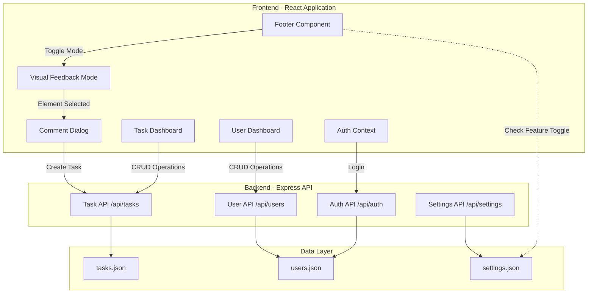
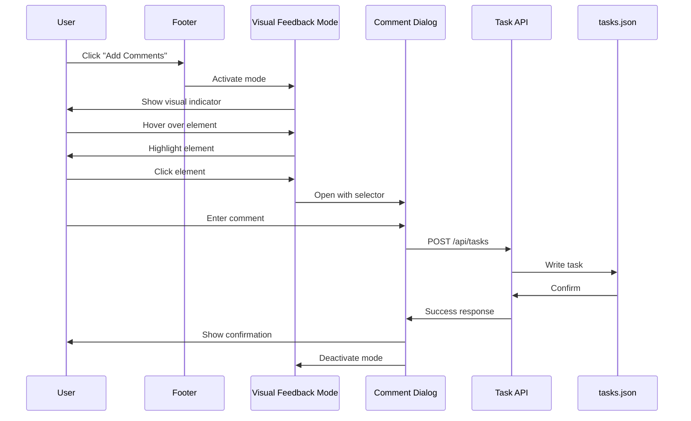
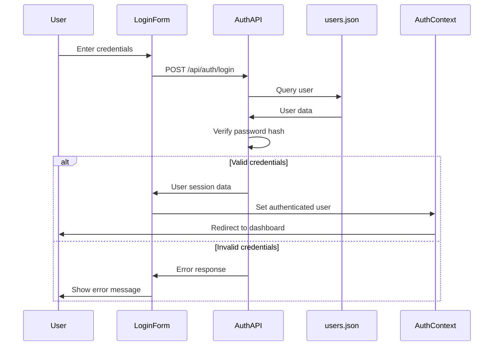

# Design Document: CMS Visual Feedback System

## Overview

The CMS Visual Feedback System introduces an interactive feedback mechanism that allows authenticated CMS users to select any DOM element on a page and attach contextual comments. This system transforms the existing single-user CMS into a multi-user collaborative platform where team members can provide visual feedback, track tasks, and manage implementation priorities.

### Key Components

1. **Visual Feedback Mode**: An interactive overlay system that enables DOM element selection through hover and click interactions
2. **Task Management System**: Backend and frontend infrastructure for creating, storing, and managing feedback tasks
3. **Multi-User Authentication**: Replacement of hardcoded authentication with a flexible user management system using password hashing
4. **CMS Dashboard Extensions**: New UI sections for task management and user administration
5. **Feature Toggle System**: Configuration-based control for enabling/disabling the feedback feature

### Design Goals

- Seamless integration with existing React/Express architecture
- Minimal disruption to current CMS functionality
- Reliable DOM element identification across page reloads
- Secure multi-user authentication with industry-standard password hashing
- Intuitive user experience for both feedback creation and task management

## Architecture

### System Architecture Diagram



### Component Interaction Flow

#### Visual Feedback Creation Flow



#### Authentication Flow



### Technology Stack Integration

The system integrates with the existing tech stack:

- **Frontend**: React 18.3 with React Router DOM 6.22
- **Backend**: Express 4.18 with ES modules
- **Styling**: Tailwind CSS 3.4
- **State Management**: React Context API (AuthContext)
- **Data Storage**: JSON files in `/public/data/`

### Library Recommendations

#### DOM Element Selection: `@highlight-run/react-dom-inspector`

**Rationale**: This library provides robust DOM element selection with hover highlighting and click handling, specifically designed for React applications.

**Features**:
- React component wrapper for easy integration
- Generates stable CSS selectors
- Handles React component boundaries
- Lightweight and actively maintained
- Compatible with React 18.3

**Alternative**: `dom-inspector` (vanilla JS) if React-specific solution has issues

#### Comment Dialog: Headless UI by Tailwind Labs

**Rationale**: Headless UI provides unstyled, accessible dialog components that integrate perfectly with Tailwind CSS.

**Features**:
- `Dialog` component with focus trapping
- Keyboard navigation (Escape to close, Tab for focus management)
- ARIA attributes for accessibility
- Fully compatible with Tailwind styling
- No style conflicts with existing design system
- Maintained by Tailwind Labs (same team as Tailwind CSS)

**Installation**:
```bash
npm install @headlessui/react
```

#### Password Hashing: bcryptjs

**Rationale**: Industry-standard password hashing library with pure JavaScript implementation (no native dependencies).

**Features**:
- Secure password hashing with salt
- Configurable work factor (default: 10 rounds)
- Synchronous and asynchronous APIs
- No compilation required (pure JS)
- Widely used and battle-tested

**Installation**:
```bash
npm install bcryptjs
```

## Components and Interfaces

### Frontend Components

#### 1. Visual Feedback Mode Component

**Location**: `src/components/VisualFeedbackMode.jsx`

**Purpose**: Manages the interactive element selection overlay

**Props**:
```javascript
{
  isActive: boolean,
  onElementSelected: (selector: string, element: HTMLElement) => void,
  onCancel: () => void
}
```

**State**:
```javascript
{
  hoveredElement: HTMLElement | null,
  selectedElement: HTMLElement | null,
  generatedSelector: string | null
}
```

**Key Methods**:
- `handleMouseOver(event)`: Highlights element on hover
- `handleClick(event)`: Captures element and generates selector
- `generateSelector(element)`: Creates unique CSS selector path
- `cleanup()`: Removes event listeners and highlights

**Implementation Notes**:
- Uses `@highlight-run/react-dom-inspector` for element selection
- Adds event listeners to document for hover/click
- Applies highlight styling via CSS class injection
- Excludes `html`, `body`, `script`, `style` tags from selection
- Prevents default click behavior during active mode

#### 2. Comment Dialog Component

**Location**: `src/components/CommentDialog.jsx`

**Purpose**: Modal dialog for entering feedback text

**Props**:
```javascript
{
  isOpen: boolean,
  selector: string,
  elementPreview: string,
  pageUrl: string,
  onSubmit: (commentText: string) => void,
  onCancel: () => void
}
```

**State**:
```javascript
{
  commentText: string,
  isSubmitting: boolean,
  error: string | null
}
```

**UI Elements**:
- Modal overlay with backdrop
- Element context display (selector path)
- Textarea for comment input (min 10 chars, max 1000 chars)
- Submit button (disabled while submitting)
- Cancel button
- Character counter

**Implementation Notes**:
- Uses Headless UI `Dialog` component
- Validates comment length before submission
- Shows loading state during API call
- Displays error messages inline
- Auto-focuses textarea on open

#### 3. Task Dashboard Component

**Location**: `src/cms/TaskDashboard.jsx`

**Purpose**: CMS interface for viewing and managing tasks

**State**:
```javascript
{
  tasks: Task[],
  filter: 'all' | 'open' | 'in-progress' | 'completed' | 'archived',
  isLoading: boolean,
  error: string | null
}
```

**UI Elements**:
- Filter tabs for task status
- Task table with columns: Page, Comment, Creator, Date, Status, Actions
- Status dropdown for each task
- Delete button for each task
- "View on Page" link that navigates with highlight parameter
- Empty state when no tasks match filter

**Key Methods**:
- `fetchTasks()`: Loads tasks from API
- `updateTaskStatus(taskId, newStatus)`: Updates task status
- `deleteTask(taskId)`: Removes task with confirmation
- `viewTaskOnPage(task)`: Navigates to page with highlight

#### 4. User Dashboard Component

**Location**: `src/cms/UserDashboard.jsx`

**Purpose**: CMS interface for managing user accounts

**State**:
```javascript
{
  users: User[],
  isLoading: boolean,
  showAddForm: boolean,
  editingUser: User | null,
  error: string | null
}
```

**UI Elements**:
- User table with columns: Username, Created Date, Actions
- "Add User" button
- Edit and Delete buttons for each user
- User form modal (for add/edit)
- Confirmation dialog for delete

**Key Methods**:
- `fetchUsers()`: Loads users from API
- `createUser(username, password)`: Creates new user
- `updateUser(userId, updates)`: Updates user information
- `deleteUser(userId)`: Removes user with confirmation

#### 5. Footer Component Enhancement

**Location**: `src/components/Footer.jsx` (existing)

**Changes**:
- Add "Add Comments" link (conditional on authentication and feature toggle)
- Import and use AuthContext to check authentication state
- Import and check feature toggle from settings
- Click handler to activate Visual Feedback Mode

**New Code**:
```javascript
const { user } = useContext(AuthContext);
const [feedbackEnabled, setFeedbackEnabled] = useState(false);

useEffect(() => {
  fetch('/api/settings')
    .then(res => res.json())
    .then(data => setFeedbackEnabled(data.visualFeedbackEnabled));
}, []);

{user && feedbackEnabled && (
  <button onClick={activateFeedbackMode}>Add Comments</button>
)}
```

#### 6. Task Highlight Component

**Location**: `src/components/TaskHighlight.jsx`

**Purpose**: Highlights and scrolls to task element when viewing from dashboard

**Props**:
```javascript
{
  selector: string,
  duration: number // milliseconds, default 3000
}
```

**Implementation**:
- Runs on component mount
- Queries DOM for selector
- Adds highlight class
- Scrolls element into view with smooth behavior
- Removes highlight after duration
- Shows warning if element not found

### Backend API Endpoints

#### Task API

**Base Path**: `/api/tasks`

**Endpoints**:

1. **GET /api/tasks**
   - Returns all tasks
   - Response: `{ tasks: Task[] }`
   - Status: 200 OK

2. **POST /api/tasks**
   - Creates new task
   - Request Body:
     ```json
     {
       "pageUrl": "string",
       "selector": "string",
       "comment": "string",
       "creator": "string"
     }
     ```
   - Response: `{ task: Task }`
   - Status: 201 Created
   - Validation: All fields required, comment min 10 chars

3. **PUT /api/tasks/:id**
   - Updates existing task
   - Request Body: `{ status?: string, comment?: string }`
   - Response: `{ task: Task }`
   - Status: 200 OK
   - Validation: Status must be valid enum value

4. **DELETE /api/tasks/:id**
   - Deletes task
   - Response: `{ message: "Task deleted" }`
   - Status: 200 OK
   - Error: 404 if task not found

#### User API

**Base Path**: `/api/users`

**Endpoints**:

1. **GET /api/users**
   - Returns all users (excluding password hashes)
   - Response: `{ users: User[] }`
   - Status: 200 OK

2. **POST /api/users**
   - Creates new user
   - Request Body:
     ```json
     {
       "username": "string",
       "password": "string"
     }
     ```
   - Response: `{ user: User }`
   - Status: 201 Created
   - Validation: Username unique, password min 8 chars
   - Password is hashed before storage

3. **PUT /api/users/:id**
   - Updates user
   - Request Body: `{ username?: string, password?: string }`
   - Response: `{ user: User }`
   - Status: 200 OK
   - Password is hashed if provided

4. **DELETE /api/users/:id**
   - Deletes user
   - Response: `{ message: "User deleted" }`
   - Status: 200 OK
   - Error: 404 if user not found

#### Auth API

**Base Path**: `/api/auth`

**Endpoints**:

1. **POST /api/auth/login**
   - Validates credentials
   - Request Body:
     ```json
     {
       "username": "string",
       "password": "string"
     }
     ```
   - Response:
     ```json
     {
       "user": {
         "id": "string",
         "username": "string"
       }
     }
     ```
   - Status: 200 OK
   - Error: 401 Unauthorized if invalid credentials

#### Settings API Enhancement

**Endpoint**: `PUT /api/settings`

**Changes**:
- Add support for `visualFeedbackEnabled` boolean field
- Validate boolean type
- Persist to settings.json

## Data Models

### Task Model

**File**: `/public/data/tasks.json`

**Structure**:
```json
{
  "tasks": [
    {
      "id": "string (UUID v4)",
      "pageUrl": "string (full URL)",
      "selector": "string (CSS selector)",
      "comment": "string (10-1000 chars)",
      "creator": "string (username)",
      "status": "open | in-progress | completed | archived",
      "createdAt": "string (ISO 8601 timestamp)",
      "updatedAt": "string (ISO 8601 timestamp)"
    }
  ]
}
```

**Field Descriptions**:
- `id`: Unique identifier generated using `crypto.randomUUID()`
- `pageUrl`: Full URL where the element exists (e.g., "http://localhost:5173/projects")
- `selector`: CSS selector path (e.g., "div.container > section.projects > div:nth-child(2)")
- `comment`: User-provided feedback text
- `creator`: Username of the user who created the task
- `status`: Current task state, defaults to "open"
- `createdAt`: Timestamp when task was created
- `updatedAt`: Timestamp when task was last modified

**Initial State**:
```json
{
  "tasks": []
}
```

### User Model

**File**: `/public/data/users.json`

**Structure**:
```json
{
  "users": [
    {
      "id": "string (UUID v4)",
      "username": "string (unique)",
      "passwordHash": "string (bcrypt hash)",
      "createdAt": "string (ISO 8601 timestamp)"
    }
  ]
}
```

**Field Descriptions**:
- `id`: Unique identifier generated using `crypto.randomUUID()`
- `username`: Unique username for login (3-50 chars, alphanumeric + underscore)
- `passwordHash`: Bcrypt hash of password (never store plain text)
- `createdAt`: Timestamp when user was created

**Initial Users**:
```json
{
  "users": [
    {
      "id": "generated-uuid-1",
      "username": "willem",
      "passwordHash": "bcrypt-hash-of-willem123",
      "createdAt": "2024-01-01T00:00:00.000Z"
    },
    {
      "id": "generated-uuid-2",
      "username": "yann",
      "passwordHash": "bcrypt-hash-of-yann123",
      "createdAt": "2024-01-01T00:00:00.000Z"
    }
  ]
}
```

**Initial Passwords**:
- Willem: `willem123`
- Yann: `yann123`

These passwords will be hashed using bcrypt with 10 salt rounds before storage.

### Settings Model Enhancement

**File**: `/public/data/settings.json` (existing)

**New Field**:
```json
{
  "visualFeedbackEnabled": true
}
```

**Field Description**:
- `visualFeedbackEnabled`: Boolean flag to enable/disable the visual feedback feature
- Default: `true`
- Controlled via CMS Settings interface

### AuthContext Enhancement

**File**: `src/contexts/AuthContext.jsx` (existing)

**Changes**:
- Replace hardcoded credential check with API call to `/api/auth/login`
- Store full user object (id, username) instead of just boolean
- Update login method signature:
  ```javascript
  const login = async (username, password) => {
    const response = await fetch('/api/auth/login', {
      method: 'POST',
      headers: { 'Content-Type': 'application/json' },
      body: JSON.stringify({ username, password })
    });
    
    if (response.ok) {
      const { user } = await response.json();
      setUser(user);
      return true;
    }
    return false;
  };
  ```

**State Shape**:
```javascript
{
  user: {
    id: string,
    username: string
  } | null,
  login: (username: string, password: string) => Promise<boolean>,
  logout: () => void
}
```


## Correctness Properties

*A property is a characteristic or behavior that should hold true across all valid executions of a system—essentially, a formal statement about what the system should do. Properties serve as the bridge between human-readable specifications and machine-verifiable correctness guarantees.*

### Property Reflection

After analyzing all acceptance criteria, I identified the following redundancies and consolidations:

**Redundancies Eliminated**:
- Properties 5.2, 5.3, 5.4 (API CRUD operations) can be consolidated with their corresponding data model properties (4.2, 4.3, etc.) since API operations are the mechanism for achieving data model requirements
- Property 8.1 (GET users excludes passwords) is subsumed by 9.8 (passwords not displayed)
- Property 8.6 (hash passwords on create/update) is subsumed by 7.6 (all passwords are hashed)
- Property 12.5 (handle React re-renders) is covered by 2.3 (stable selectors)
- Property 14.2 is duplicate of 7.4

**Consolidations**:
- Properties 2.1 and 2.2 (hover highlight and click capture) can be combined into a single element selection property
- Properties 6.5 and 6.6 (update and delete tasks) can be combined into a task management property
- Properties 9.5 and 9.6 (user CRUD operations) can be combined into a user management property
- Properties 11.2, 11.3, 11.4 (navigate, highlight, scroll) can be combined into a single "view on page" property

### Property 1: Element Selection and Highlighting

*For any* selectable DOM element (excluding html, body, script, style tags), hovering over the element in Visual Feedback Mode should highlight it, and clicking the highlighted element should capture a stable, unique CSS selector for that element.

**Validates: Requirements 2.1, 2.2, 2.3, 2.5**

### Property 2: Task Creation Completeness

*For any* valid comment submission (non-empty text, valid selector, authenticated user), the created task should contain all required fields: unique ID, page URL, DOM selector, comment text, creator username, creation timestamp, and status initialized to "open".

**Validates: Requirements 3.4, 3.6, 4.2, 4.3, 4.4**

### Property 3: Task Data Persistence

*For any* task created through the API, querying the tasks.json file should return the task with all its data intact, and the task should be retrievable via GET /api/tasks.

**Validates: Requirements 4.1, 4.6, 5.1, 5.2**

### Property 4: Task Status Transitions

*For any* task and any valid status value ("open", "in-progress", "completed", "archived"), updating the task's status through the API should persist the new status and make it queryable.

**Validates: Requirements 4.5, 5.3, 6.5**

### Property 5: Task Deletion

*For any* existing task, deleting it through the API should remove it from storage, and subsequent queries should not return the deleted task.

**Validates: Requirements 5.4, 6.6**

### Property 6: API Error Handling

*For any* invalid API request (missing required fields, invalid task ID, invalid status value), the API should return an appropriate HTTP error code (400, 404, etc.) and a descriptive error message.

**Validates: Requirements 5.5, 5.6, 8.7**

### Property 7: Task Metadata Display

*For any* task displayed in the CMS dashboard, all metadata fields (page URL, comment text, creator, creation date, status, DOM selector) should be visible to the user.

**Validates: Requirements 6.3, 6.8**

### Property 8: Task Filtering

*For any* status filter applied in the CMS dashboard, only tasks matching that status should be displayed, and changing the filter should update the displayed tasks accordingly.

**Validates: Requirements 6.4**

### Property 9: User Data Completeness

*For any* user created through the API, the stored user should contain all required fields: unique ID, username, hashed password (not plain text), and creation timestamp.

**Validates: Requirements 7.3, 7.6, 8.2, 8.6**

### Property 10: User Authentication

*For any* set of credentials, login should succeed if and only if the username exists and the provided password matches the stored hash, returning user session data on success and error on failure.

**Validates: Requirements 7.5, 8.5**

### Property 11: User CRUD Operations

*For any* valid user data, the API should support creating new users (with unique usernames), updating existing users, and deleting users, with all operations reflected in the users.json file.

**Validates: Requirements 8.3, 8.4, 9.5, 9.6, 9.7**

### Property 12: Password Hash Security

*For any* user retrieved through GET /api/users or displayed in the CMS, the password hash should not be included in the response or visible in the UI.

**Validates: Requirements 8.1, 9.8**

### Property 13: User Operation Confirmation

*For any* successful user operation (create, update, delete) in the CMS, a visual confirmation message should be displayed to the user.

**Validates: Requirements 9.9**

### Property 14: Feature Toggle Control

*For any* state of the visualFeedbackEnabled setting, when the setting is false, the "Add Comments" link should not appear in the footer and Visual Feedback Mode should not activate, regardless of authentication status.

**Validates: Requirements 10.2, 10.3**

### Property 15: Task Element Highlighting on Page

*For any* task with a valid DOM selector, clicking "View on Page" should navigate to the task's URL, highlight the element matching the selector, and scroll it into view.

**Validates: Requirements 11.1, 11.2, 11.3, 11.4**

### Property 16: Comment Dialog Keyboard Accessibility

*For any* keyboard interaction with the Comment Dialog (Tab, Enter, Escape), the dialog should respond appropriately: Tab should navigate between elements, Enter should submit the form, and Escape should cancel and close the dialog.

**Validates: Requirements 13.2**

### Property 17: Settings Data Preservation

*For any* existing settings in settings.json, adding the visualFeedbackEnabled field should preserve all existing settings without modification or deletion.

**Validates: Requirements 14.5**

## Error Handling

### Frontend Error Handling

**Visual Feedback Mode Errors**:
- **Element Not Found**: If a task's DOM selector cannot be found when highlighting, display a toast notification: "Element not found on this page. The page structure may have changed."
- **Selector Generation Failure**: If selector generation fails, log error to console and show user message: "Unable to select this element. Please try another element."
- **Network Errors**: If API calls fail during task creation, show error message in Comment Dialog: "Failed to save comment. Please try again."

**Task Dashboard Errors**:
- **Load Failure**: If tasks fail to load, display error message: "Unable to load tasks. Please refresh the page."
- **Update Failure**: If task status update fails, revert UI to previous state and show toast: "Failed to update task status."
- **Delete Failure**: If task deletion fails, show toast: "Failed to delete task. Please try again."

**User Dashboard Errors**:
- **Load Failure**: If users fail to load, display error message: "Unable to load users. Please refresh the page."
- **Duplicate Username**: If username already exists, show inline error: "Username already exists. Please choose another."
- **Create/Update Failure**: If user operation fails, show toast with server error message
- **Delete Failure**: If user deletion fails, show toast: "Failed to delete user. Please try again."

**Authentication Errors**:
- **Invalid Credentials**: Show inline error on login form: "Invalid username or password."
- **Network Error**: Show error message: "Unable to connect to server. Please try again."
- **Session Expired**: Redirect to login with message: "Your session has expired. Please log in again."

### Backend Error Handling

**Task API Error Responses**:
- **400 Bad Request**: Missing required fields or invalid data format
  ```json
  { "error": "Missing required field: comment" }
  ```
- **404 Not Found**: Task ID does not exist
  ```json
  { "error": "Task not found" }
  ```
- **500 Internal Server Error**: File system errors or unexpected failures
  ```json
  { "error": "Internal server error" }
  ```

**User API Error Responses**:
- **400 Bad Request**: Invalid user data or duplicate username
  ```json
  { "error": "Username already exists" }
  ```
- **401 Unauthorized**: Invalid login credentials
  ```json
  { "error": "Invalid username or password" }
  ```
- **404 Not Found**: User ID does not exist
  ```json
  { "error": "User not found" }
  ```
- **500 Internal Server Error**: File system errors, bcrypt failures, or unexpected errors
  ```json
  { "error": "Internal server error" }
  ```

**File System Error Handling**:
- All file read/write operations wrapped in try-catch blocks
- Failed reads return empty arrays/objects with logged errors
- Failed writes return 500 status with error message
- File corruption detected and logged with fallback to backup if available

**Validation Error Handling**:
- All API endpoints validate input before processing
- Return 400 status with specific field errors
- Log validation failures for debugging
- Never expose internal system details in error messages

### Error Recovery Strategies

**Graceful Degradation**:
- If Visual Feedback Mode fails to initialize, hide the "Add Comments" link
- If task highlighting fails, still allow navigation to the page
- If user list fails to load, still allow login functionality

**Retry Logic**:
- Network requests retry once after 1 second delay
- File operations retry once on EBUSY errors
- No retry on validation errors (400 status)

**Data Integrity**:
- Validate JSON structure before writing to files
- Create backup of existing file before overwriting
- Rollback to backup if write operation fails
- Log all data integrity issues for investigation

## Testing Strategy

### Dual Testing Approach

This feature requires both unit tests and property-based tests to ensure comprehensive coverage:

**Unit Tests**: Focus on specific examples, edge cases, and integration points
- Specific UI interactions (button clicks, form submissions)
- Edge cases (empty inputs, missing elements, invalid selectors)
- Error conditions (network failures, invalid data)
- Component rendering with specific props
- API endpoint responses for specific inputs

**Property-Based Tests**: Verify universal properties across all inputs
- Task creation with various comment texts and selectors
- User authentication with various credential combinations
- Task filtering with various status values
- Selector generation stability across multiple calls
- Data persistence across multiple operations

### Property-Based Testing Configuration

**Library**: `fast-check` for JavaScript/TypeScript property-based testing

**Installation**:
```bash
npm install --save-dev fast-check
```

**Configuration**:
- Minimum 100 iterations per property test
- Each test tagged with comment referencing design property
- Tag format: `// Feature: cms-visual-feedback-system, Property {number}: {property_text}`

**Example Property Test Structure**:
```javascript
import fc from 'fast-check';

// Feature: cms-visual-feedback-system, Property 2: Task Creation Completeness
test('task creation includes all required fields', () => {
  fc.assert(
    fc.property(
      fc.string({ minLength: 10, maxLength: 1000 }), // comment
      fc.webUrl(), // pageUrl
      fc.string({ minLength: 5 }), // selector
      fc.string({ minLength: 3 }), // username
      async (comment, pageUrl, selector, username) => {
        const task = await createTask({ comment, pageUrl, selector, username });
        
        expect(task).toHaveProperty('id');
        expect(task).toHaveProperty('pageUrl', pageUrl);
        expect(task).toHaveProperty('selector', selector);
        expect(task).toHaveProperty('comment', comment);
        expect(task).toHaveProperty('creator', username);
        expect(task).toHaveProperty('status', 'open');
        expect(task).toHaveProperty('createdAt');
        expect(task).toHaveProperty('updatedAt');
      }
    ),
    { numRuns: 100 }
  );
});
```

### Unit Testing Strategy

**Frontend Component Tests** (using React Testing Library + Vitest):

1. **Visual Feedback Mode Component**:
   - Renders with active state
   - Highlights element on hover
   - Captures selector on click
   - Excludes non-content elements
   - Cleans up event listeners on unmount

2. **Comment Dialog Component**:
   - Renders with correct props
   - Validates comment length
   - Submits with valid input
   - Cancels and closes
   - Shows error messages
   - Keyboard accessibility (Tab, Enter, Escape)

3. **Task Dashboard Component**:
   - Loads and displays tasks
   - Filters tasks by status
   - Updates task status
   - Deletes task with confirmation
   - Navigates to task page
   - Handles empty state

4. **User Dashboard Component**:
   - Loads and displays users
   - Creates new user
   - Validates unique username
   - Updates user
   - Deletes user with confirmation
   - Hides password hashes

5. **Footer Component**:
   - Shows "Add Comments" link when authenticated and feature enabled
   - Hides link when not authenticated
   - Hides link when feature disabled
   - Activates Visual Feedback Mode on click

**Backend API Tests** (using Supertest + Vitest):

1. **Task API Endpoints**:
   - GET /api/tasks returns all tasks
   - POST /api/tasks creates task with valid data
   - POST /api/tasks rejects invalid data (400)
   - PUT /api/tasks/:id updates task
   - PUT /api/tasks/:id rejects invalid status (400)
   - DELETE /api/tasks/:id removes task
   - DELETE /api/tasks/:id returns 404 for non-existent task

2. **User API Endpoints**:
   - GET /api/users returns users without password hashes
   - POST /api/users creates user with hashed password
   - POST /api/users rejects duplicate username (400)
   - PUT /api/users/:id updates user
   - DELETE /api/users/:id removes user
   - POST /api/auth/login succeeds with valid credentials
   - POST /api/auth/login fails with invalid credentials (401)

3. **Settings API Endpoint**:
   - PUT /api/settings updates visualFeedbackEnabled
   - PUT /api/settings preserves existing settings

**Integration Tests**:

1. **End-to-End Task Creation Flow**:
   - Login as user
   - Enable Visual Feedback Mode
   - Select element
   - Submit comment
   - Verify task appears in dashboard
   - Verify task stored in tasks.json

2. **End-to-End User Management Flow**:
   - Login as admin
   - Create new user
   - Verify user stored in users.json
   - Login as new user
   - Verify authentication works

3. **Feature Toggle Flow**:
   - Disable feature in settings
   - Verify "Add Comments" link hidden
   - Enable feature
   - Verify link appears

### Test Coverage Goals

- **Frontend Components**: 80% code coverage minimum
- **Backend API**: 90% code coverage minimum
- **Property Tests**: All 17 properties implemented
- **Integration Tests**: All critical user flows covered

### Testing Best Practices

1. **Isolation**: Each test should be independent and not rely on other tests
2. **Cleanup**: Reset database files (tasks.json, users.json) between tests
3. **Mocking**: Mock external dependencies (file system, network) where appropriate
4. **Assertions**: Use specific assertions that clearly indicate what failed
5. **Error Cases**: Test both success and failure paths
6. **Edge Cases**: Test boundary conditions (empty strings, max lengths, special characters)
7. **Performance**: Property tests should complete in reasonable time (<5 seconds per property)

### Continuous Integration

- Run all tests on every commit
- Fail build if any test fails
- Generate coverage reports
- Track coverage trends over time
- Run property tests with increased iterations (1000) in CI for deeper validation


## Implementation Notes

### Phase 1: Backend Infrastructure

**Priority**: High - Foundation for all other features

1. **Install Dependencies**:
   ```bash
   npm install bcryptjs
   ```

2. **Create Data Files**:
   - Initialize `/public/data/users.json` with willem and yann users
   - Initialize `/public/data/tasks.json` with empty array
   - Add `visualFeedbackEnabled: true` to `/public/data/settings.json`

3. **Implement User API** (`server.js`):
   - Add bcryptjs import
   - Create helper functions: `readUsers()`, `writeUsers()`, `hashPassword()`, `verifyPassword()`
   - Implement GET /api/users (exclude passwordHash)
   - Implement POST /api/users (hash password before storage)
   - Implement PUT /api/users/:id (hash password if provided)
   - Implement DELETE /api/users/:id
   - Implement POST /api/auth/login (verify credentials)

4. **Implement Task API** (`server.js`):
   - Create helper functions: `readTasks()`, `writeTasks()`
   - Implement GET /api/tasks
   - Implement POST /api/tasks (validate required fields)
   - Implement PUT /api/tasks/:id (validate status enum)
   - Implement DELETE /api/tasks/:id

5. **Update Settings API** (`server.js`):
   - Add support for `visualFeedbackEnabled` field in PUT /api/settings

### Phase 2: Authentication System

**Priority**: High - Required for user-specific features

1. **Update AuthContext** (`src/contexts/AuthContext.jsx`):
   - Change state from boolean to user object: `{ id, username }`
   - Update login method to call POST /api/auth/login
   - Store full user object on successful login
   - Update logout to clear user object

2. **Update Login Component** (`src/cms/Login.jsx`):
   - Update to use new AuthContext API
   - Display appropriate error messages for failed login

3. **Test Authentication**:
   - Verify login with willem/willem123
   - Verify login with yann/yann123
   - Verify failed login with invalid credentials

### Phase 3: User Management UI

**Priority**: Medium - Admin functionality

1. **Install Dependencies**:
   ```bash
   npm install @headlessui/react
   ```

2. **Create User Dashboard** (`src/cms/UserDashboard.jsx`):
   - Implement user list table
   - Implement "Add User" button and form modal
   - Implement edit user functionality
   - Implement delete user with confirmation
   - Add form validation (unique username, password length)
   - Add success/error toast notifications

3. **Update CMS Navigation**:
   - Add "Users" link to dashboard navigation
   - Add route in `App.jsx`: `/cms/users` → `<UserDashboard />`

### Phase 4: Task Management Backend Integration

**Priority**: High - Core feature functionality

1. **Create Task Dashboard** (`src/cms/TaskDashboard.jsx`):
   - Implement task list table with all metadata columns
   - Implement status filter tabs
   - Implement status update dropdown
   - Implement delete task with confirmation
   - Implement "View on Page" link with URL parameter
   - Add success/error toast notifications

2. **Update CMS Navigation**:
   - Add "Tasks" link to dashboard navigation
   - Add route in `App.jsx`: `/cms/tasks` → `<TaskDashboard />`

### Phase 5: Visual Feedback Mode

**Priority**: High - Core feature functionality

1. **Install Dependencies**:
   ```bash
   npm install @highlight-run/react-dom-inspector
   ```

2. **Create Visual Feedback Mode Component** (`src/components/VisualFeedbackMode.jsx`):
   - Integrate @highlight-run/react-dom-inspector
   - Implement hover highlighting
   - Implement click selection
   - Implement selector generation
   - Add visual indicator for active mode
   - Add cancel/close functionality
   - Exclude non-content elements

3. **Create Comment Dialog Component** (`src/components/CommentDialog.jsx`):
   - Use Headless UI Dialog component
   - Implement form with textarea
   - Add element context display
   - Add character counter
   - Implement submit handler (POST /api/tasks)
   - Implement cancel handler
   - Add keyboard accessibility
   - Add loading and error states

4. **Update Footer Component** (`src/components/Footer.jsx`):
   - Import AuthContext
   - Fetch visualFeedbackEnabled from settings
   - Conditionally render "Add Comments" link
   - Implement click handler to activate Visual Feedback Mode
   - Pass current user to Visual Feedback Mode

5. **Create App-Level State Management**:
   - Add state in `App.jsx` or create new context for Visual Feedback Mode
   - Manage mode activation/deactivation
   - Pass state to Footer and Visual Feedback Mode components

### Phase 6: Task Highlighting

**Priority**: Medium - Enhanced UX

1. **Create Task Highlight Component** (`src/components/TaskHighlight.jsx`):
   - Accept selector and duration props
   - Query DOM for selector on mount
   - Add highlight CSS class
   - Scroll element into view
   - Remove highlight after duration
   - Show warning if element not found

2. **Update Task Dashboard**:
   - Modify "View on Page" links to include task ID in URL parameter
   - Example: `/projects?highlightTask=task-id-123`

3. **Update Page Components**:
   - Check for `highlightTask` URL parameter on mount
   - Fetch task data if parameter present
   - Render TaskHighlight component with task's selector

### Phase 7: Feature Toggle

**Priority**: Low - Configuration feature

1. **Update Settings Component** (`src/cms/Settings.jsx`):
   - Add toggle control for "Enable Visual Feedback"
   - Bind to `visualFeedbackEnabled` in settings
   - Update on toggle change (PUT /api/settings)

2. **Test Feature Toggle**:
   - Disable feature, verify link hidden
   - Enable feature, verify link appears
   - Verify no page reload required

### Phase 8: Testing

**Priority**: High - Quality assurance

1. **Setup Testing Infrastructure**:
   ```bash
   npm install --save-dev fast-check @testing-library/react @testing-library/user-event supertest
   ```

2. **Write Unit Tests**:
   - Frontend component tests (all components from Phase 3-6)
   - Backend API tests (all endpoints from Phase 1)
   - Integration tests (end-to-end flows)

3. **Write Property-Based Tests**:
   - Implement all 17 properties from design document
   - Configure 100 iterations per test
   - Add property reference comments

4. **Run Tests and Fix Issues**:
   - Achieve 80%+ frontend coverage
   - Achieve 90%+ backend coverage
   - Fix any failing tests

### Phase 9: Documentation and Deployment

**Priority**: Medium - User enablement

1. **Update README**:
   - Document new features
   - Document initial user credentials
   - Document API endpoints
   - Document testing approach

2. **Create User Guide**:
   - How to use Visual Feedback Mode
   - How to manage tasks
   - How to manage users
   - How to toggle feature on/off

3. **Deployment Checklist**:
   - Verify all tests pass
   - Verify data files initialized correctly
   - Verify initial users can log in
   - Verify feature toggle works
   - Verify task creation and management works

## Integration with Existing CMS Architecture

### Minimal Changes to Existing Code

The design minimizes disruption to existing functionality:

**Files Modified**:
1. `server.js` - Add new API endpoints (no changes to existing endpoints)
2. `src/contexts/AuthContext.jsx` - Update authentication logic
3. `src/cms/Login.jsx` - Update to use new AuthContext API
4. `src/components/Footer.jsx` - Add conditional "Add Comments" link
5. `src/cms/Settings.jsx` - Add feature toggle control
6. `src/App.jsx` - Add new routes for Tasks and Users dashboards
7. `/public/data/settings.json` - Add visualFeedbackEnabled field

**Files Created** (no impact on existing code):
1. `src/components/VisualFeedbackMode.jsx`
2. `src/components/CommentDialog.jsx`
3. `src/components/TaskHighlight.jsx`
4. `src/cms/TaskDashboard.jsx`
5. `src/cms/UserDashboard.jsx`
6. `/public/data/tasks.json`
7. `/public/data/users.json`

### Backward Compatibility

**Authentication Migration**:
- Old hardcoded credentials (admin/admin123) will no longer work
- Users must use new credentials (willem/willem123 or yann/yann123)
- No automatic migration of old sessions (users must log in again)

**Settings Preservation**:
- Existing settings.json data is preserved
- New visualFeedbackEnabled field added without affecting existing fields
- Default value (true) ensures feature is enabled by default

**Data Isolation**:
- New data files (tasks.json, users.json) do not affect existing data
- Existing data files (projects.json, news.json, pages.json) unchanged
- No schema changes to existing data structures

### Performance Considerations

**Frontend Performance**:
- Visual Feedback Mode only active when explicitly enabled by user
- Event listeners added/removed dynamically (no permanent overhead)
- Comment Dialog uses portal rendering (no layout thrashing)
- Task highlighting uses CSS transforms (GPU-accelerated)

**Backend Performance**:
- File-based storage suitable for small-to-medium task volumes (<1000 tasks)
- Consider database migration if task volume exceeds 10,000
- Bcrypt hashing adds ~100ms per login (acceptable for user authentication)
- No impact on existing API endpoints

**Bundle Size**:
- @headlessui/react: ~15KB gzipped
- @highlight-run/react-dom-inspector: ~8KB gzipped
- bcryptjs: ~25KB gzipped
- fast-check (dev only): No production impact
- Total production bundle increase: ~48KB gzipped

### Security Considerations

**Password Security**:
- Bcrypt with 10 salt rounds (industry standard)
- Passwords never stored in plain text
- Password hashes never exposed via API or UI
- No password reset functionality (manual admin intervention required)

**Authentication Security**:
- Session management via AuthContext (client-side only)
- No JWT or server-side sessions (suitable for single-page app)
- Consider adding session expiration for enhanced security
- Consider adding HTTPS requirement for production

**Input Validation**:
- All API endpoints validate input before processing
- SQL injection not applicable (file-based storage)
- XSS prevention via React's built-in escaping
- DOM selector validation to prevent malicious selectors

**Access Control**:
- All CMS routes protected by ProtectedRoute component
- Task creation requires authentication
- User management requires authentication
- Consider adding role-based access control (admin vs. regular user)

### Scalability Considerations

**Current Limitations**:
- File-based storage not suitable for high concurrency
- No locking mechanism for concurrent writes
- No task assignment or workflow features
- No real-time collaboration features

**Future Enhancements**:
- Migrate to database (SQLite, PostgreSQL) for better concurrency
- Add task assignment to specific users
- Add task priority and due dates
- Add email notifications for task updates
- Add real-time updates via WebSockets
- Add task comments/discussion threads
- Add file attachments to tasks
- Add task search and advanced filtering

### Browser Compatibility

**Supported Browsers**:
- Chrome 90+ (full support)
- Firefox 88+ (full support)
- Safari 14+ (full support)
- Edge 90+ (full support)

**Required Browser Features**:
- ES6+ JavaScript support
- CSS Grid and Flexbox
- Fetch API
- LocalStorage (for AuthContext)
- CSS custom properties (Tailwind)

**Known Limitations**:
- IE11 not supported (React 18 requirement)
- Mobile Safari may have touch event issues with element selection
- Consider adding touch event handling for mobile devices

## Conclusion

This design provides a comprehensive blueprint for implementing the CMS Visual Feedback System. The architecture integrates seamlessly with the existing React/Express stack while introducing powerful new capabilities for collaborative content management.

Key design decisions:
- **Library Selection**: Proven libraries (@headlessui/react, bcryptjs) ensure reliability and maintainability
- **Minimal Disruption**: New features added without breaking existing functionality
- **Security First**: Industry-standard password hashing and input validation
- **Testability**: Comprehensive property-based and unit testing strategy
- **Scalability**: Clear path for future enhancements and database migration

The phased implementation approach allows for incremental development and testing, reducing risk and enabling early feedback. The dual testing strategy (unit + property-based) ensures both specific behaviors and universal properties are validated.

